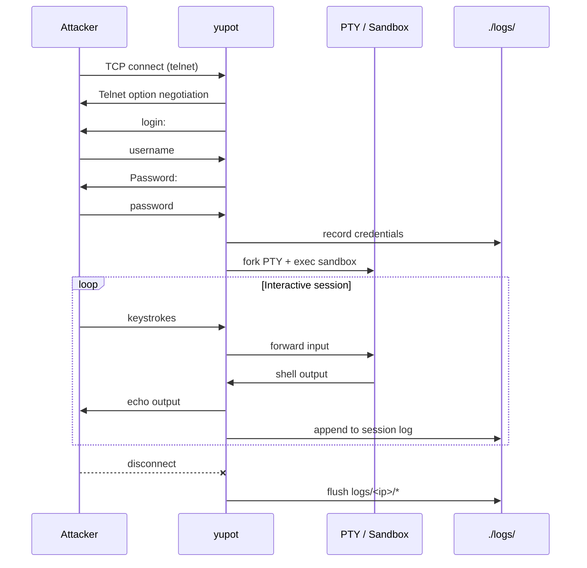

<div align="center">

# 🍯 yupot

**A fast, async Telnet honeypot written in Rust.**

Lure scanners in. Capture credentials. Log every keystroke. Drop attackers into an isolated shell.

<br>

[](https://www.rust-lang.org/)
[](https://tokio.rs/)
[](#license)

<br>

```
   ┌─────────────┐         ┌──────────────────┐         ┌─────────────────┐
   │  Attacker   │  telnet │      yupot       │   PTY   │  sandboxed env  │
   │  (scanner)  │ ──────► │  login + log     │ ──────► │  systemd-nspawn │
   └─────────────┘         └──────────────────┘         └─────────────────┘
                                    │
                                    ▼
                           ./logs/<ip>/login
                           ./logs/<ip>/commands
```

</div>

---

## What is this?

**yupot** is a lightweight honeypot that exposes fake Telnet services on configurable ports. When someone connects, it:

1. **Negotiates** a Telnet session
2. **Prompts** for a username and password (and records both)
3. **Spawns** an interactive shell inside an isolated environment via PTY
4. **Mirrors** the full session back to the attacker while logging every command

Built for defenders, researchers, and anyone who wants visibility into automated attacks — without giving attackers a real machine.

---

## Features

| | |
|---|---|
| ⚡ **Async I/O** | Powered by [Tokio](https://tokio.rs/) — handles many concurrent connections without breaking a sweat |
| 🖥️ **Real shell feel** | Full PTY emulation with backspace, echo, and line editing |
| 🔐 **Credential capture** | Every login attempt is logged with source IP |
| 📝 **Session logging** | Complete command history written to disk on disconnect |
| 📦 **Sandboxed execution** | Shell runs inside whatever you configure — `systemd-nspawn`, chroot, or any binary |
| 🔌 **Multi-port** | Bind as many Telnet ports as you want from a single config file |
| 🎨 **Pretty logging** | Color-coded console output so you can spot connections at a glance |

---

## How it works



On disconnect, yupot writes two files per attacker IP:

```
logs/
└── 203.0.113.42/
    ├── login       # [(username, password), ...]
    └── commands    # full session transcript
```

---

## Quick start

### Prerequisites

- **Rust** (2024 edition) — [install via rustup](https://rustup.rs/)
- **Linux** — uses `forkpty`, `nix`, and optional `systemd-nspawn`
- A sandbox root filesystem if using container isolation (see [Configuration](#configuration))

### Build & run

```bash
git clone https://github.com/your-username/yupot.git
cd yupot

# Copy and edit the config
cp config.json config.local.json   # optional — or edit config.json directly

cargo build --release
./target/release/yupot
```

You'll see colored output as ports come online and attackers connect:

```
[ Ok! ] Parsing Config
[ Important! ] ---------- [ Important! ]
{
  "telnetports": [23, 34],
  ...
}
[ Ok! ] Config Parsed!, Starting Server
[ Ok! ] port: 23, started!
[ Ok! ] port: 34, started!
[ Ok! ] new connection, addr: 203.0.113.42
```

### Test it locally

```bash
telnet localhost 23
# login: root
# Password: root
# → you get a shell inside the configured sandbox
```

> Default accepted credentials are **`root` / `root`**. Change the logic in `src/telnet/shell.rs` if you want different bait.

---

## Configuration

yupot reads `./config.json` at startup:

```json
{
    "telnetports": [23, 34],
    "sshports": [22],
    "bin": "systemd-nspawn",
    "args": [
        "-q",
        "-D",
        "/path/to/sandbox/rootfs"
    ]
}
```

| Field | Description |
|---|---|
| `telnetports` | List of ports to bind Telnet listeners on |
| `sshports` | Reserved for future SSH honeypot support |
| `bin` | Binary executed inside the PTY child process |
| `args` | Arguments passed to `bin` |

### Example: systemd-nspawn sandbox

Point `bin` at `systemd-nspawn` and set `-D` to a minimal root filesystem. Attackers get a convincing shell; your host stays untouched.

```json
{
    "telnetports": [23, 2323, 8023],
    "sshports": [],
    "bin": "systemd-nspawn",
    "args": ["-q", "-D", "/var/lib/yupot/sandbox"]
}
```

### Example: plain bash (dev only)

```json
{
    "telnetports": [2323],
    "sshports": [],
    "bin": "/bin/bash",
    "args": ["--login"]
}
```

> ⚠️ Running an un-sandboxed shell gives attackers real access. Use a container or chroot in production.

---

## Project structure

```
yupot/
├── config.json          # runtime configuration
├── src/
│   ├── main.rs          # entry point
│   ├── config/          # JSON config loader
│   ├── prtylog.rs       # colored console macros
│   └── telnet/
│       ├── server.rs    # TCP listener + telnet negotiation
│       ├── client.rs    # per-connection state + logging
│       ├── shell.rs     # login prompt + PTY relay loop
│       └── pty.rs       # async non-blocking PTY wrapper
└── logs/                # created at runtime (per-IP logs)
```

---

## Tech stack

- **[Tokio](https://tokio.rs/)** — async TCP and I/O
- **[nix](https://github.com/nix-rust/nix)** — PTY forking, signal handling
- **[serde / serde_json](https://serde.rs/)** — config parsing
- **[anyhow](https://docs.rs/anyhow)** — ergonomic error handling

---

## Roadmap

- [ ] SSH honeypot (`sshports` config field is already wired in)
- [ ] Configurable fake credentials via config
- [ ] Rate limiting / IP blocklists
- [ ] JSON or syslog export for SIEM integration

---

## ⚠️ Legal & ethical use

yupot is a **defensive security tool**. Only deploy it on networks and systems you own or have explicit permission to monitor. Honeypots collect sensitive data (credentials attackers try, source IPs, session content). Handle logs responsibly and in compliance with applicable law.

---

## License

MIT — use it, fork it, honeypot the planet responsibly.

---

<div align="center">

**Built with Rust 🦀 · Because attackers deserve a fake shell, not yours.**

</div>
